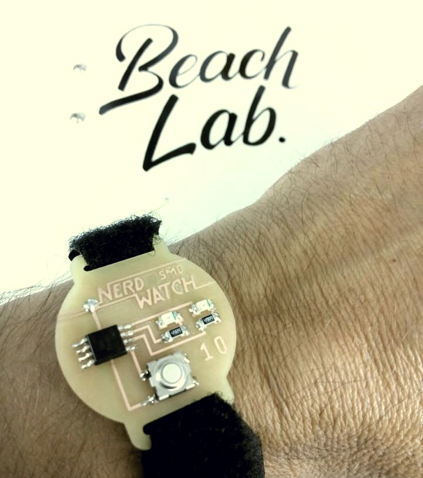
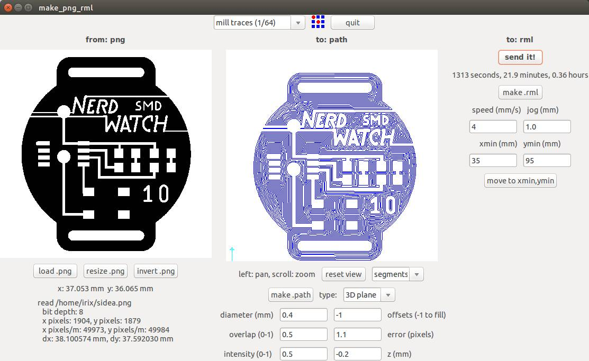

# The Beach Lab Nerd Watch Kokopelli Port
This is a [kokopelli 0.05](http://beachlab.org/fab2016/kokoretro.html) and assembly port of [Sam DeRose's Nerd Watch](http://www.instructables.com/id/The-Nerd-Watch/). There are 2 reasons why I felt the need to port the _nerds watch_. The first one is because I _only_ use kokopelli and eagle makes me feel sick. And the second one is because with Sam's code the watch only runs for three days.

### Folder structure
**code** Contains the original arduino code and the new assembly code.  
**kokopelli_circuit** Contains the kokopelli `.cad` circuit board.  
**milling_images** For those lazy guys that want to fabricate the watch straight away.  

### Fabrication
The most straight forward to mill the circuit board is using the [fab modules](http://kokompe.cba.mit.edu/). Inside the **milling_images** folder you will find `.png` files for the traces, holes, cutout and side b traces. You should execute them in this order.

Also I included the [Gimp](https://www.gimp.org/) `.xcf` files in case you want to personalise the text on the watch.
